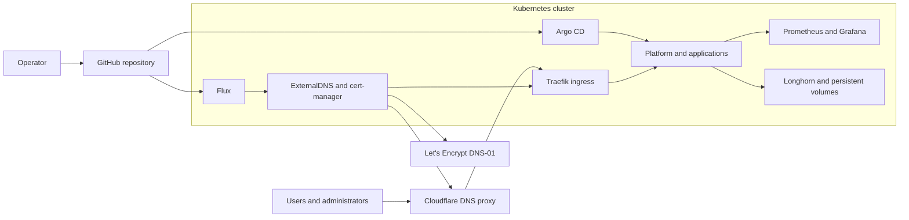

# k8s-home-lab

Public-safe Kubernetes, GitOps, and DevSecOps platform reference repository for a home-lab environment. It is written as a B2B portfolio project: the repo shows production-style structure, operating discipline, platform ownership, and security hygiene without publishing private infrastructure state or credentials.

## Purpose

This repository demonstrates how a small platform team could organize a Kubernetes estate:

- Kubernetes platform services: Traefik, MetalLB, Longhorn/local storage, monitoring, backup, and CI/CD.
- GitOps patterns with Argo CD and Flux.
- Public-safe application examples, including the Kasm Kubernetes migration scaffold.
- Security baseline documentation for hosts, Kubernetes, secrets, scanning, and observability.
- IaC boundaries for private Terraform provisioning and private Ansible/security automation.

## Target Architecture

The intended architecture is split by responsibility:

- This public repo contains sanitized docs, examples, templates, GitOps structure, and platform manifests.
- A private Terraform repo owns real infrastructure provisioning such as VMs, DNS, object storage, and firewall/provider resources.
- A private Ansible/security repo owns real inventories, host hardening, SSH, auditd, ClamAV, Maldet, Wazuh, Fail2ban, and Kubernetes node prerequisites.
- Private app repos own application source code and CI pipelines.
- Argo CD or Flux reconciles approved Kubernetes desired state into the cluster.

### Platform At A Glance



See [Platform Architecture Diagrams](docs/diagrams/platform-architecture.md)
for the detailed runtime, GitOps, DNS, certificate, and repository views.

## Included

- `apps/kasm/`: Kasm Kubernetes/GitOps scaffold for migrating away from host-managed Docker Compose.
- `platform/`: platform service examples for GitOps-managed Kubernetes services.
- `clusters/` and `flux/`: cluster and Flux wiring examples.
- `infra/`: cluster-adjacent networking and storage examples.
- `docs/`: architecture, runbooks, operating model, safety checklist, and security baseline.
- `infra-security/`: public-safe Ansible/security example structure and non-destructive scripts.
- `tools/`: local validation and scanner setup helpers.

## Intentionally Excluded

The following must stay private or ignored:

- real secrets, kubeconfigs, private keys, OAuth secrets, database passwords, and registry credentials
- Terraform state, real `tfvars`, backend credentials, and provider credentials
- Ansible vault files, private inventories, host credentials, and Wazuh enrollment secrets
- generated cluster exports under `platform/exports/` and `platform/exports-clean/`
- nested private app repositories and runtime data
- logs, uploads, backups, database dumps, and local `.env` files

## GitOps Approach

Git is the source of truth for Kubernetes desired state. Flux owns production
cluster bootstrap and platform automation under `clusters/production`. Argo CD
owns applications registered through the production ApplicationSet. The two
controllers must never reconcile the same Kubernetes resource.

## Security Posture

The baseline favors public-safe examples and private operational data. Real secrets should use SOPS, SealedSecrets, ExternalSecrets, or manual secret creation outside public Git. Host hardening belongs in private Ansible automation, while Kubernetes policy can be introduced with Kyverno, Falco, Trivy, RBAC reviews, and NetworkPolicies.

## Observability And Backup

Monitoring is expected to use Prometheus, Grafana, Loki, and Alertmanager patterns. Backup examples use Velero and MinIO/S3-compatible concepts, with credentials and real backup targets kept outside public Git. Restore procedures should be tested in private environments before being represented as production-ready.

## Safe Usage Disclaimer

This repository must not contain real secrets, kubeconfigs, private keys, OAuth secrets, database passwords, Terraform state, Ansible vault data, generated cluster exports, or private nested application repositories.

Private or generated content should stay outside Git or in separate private repositories:

- Nested app repositories are local/private and ignored unless intentionally converted into sanitized public examples.
- `platform/exports/` and `platform/exports-clean/` are generated cluster exports and must remain untracked.
- Real Drone, database, OAuth, and registry secrets must be created through SOPS, SealedSecrets, ExternalSecrets, or manual secret creation outside public Git.
- Terraform provisioning will live in a separate private repository.
- Real Ansible inventory and host hardening automation can live in a separate private infra-security repository.

## Repository Layout

```text
apps/              Public app scaffolds and ignored local app workspaces
clusters/          Cluster GitOps entry points
flux/              Flux app wiring examples
infra/             Cluster-adjacent infrastructure manifests
platform/          Platform service manifests and examples
docs/              Architecture, operating model, runbooks, and plans
infra-security/    Public-safe security automation examples and SOPs
tools/             Local helper scripts and scanner install guidance
```

## Key Documentation

- [Documentation Index](docs/README.md)
- [Review Guide](docs/review-guide.md)
- [Architecture](docs/architecture.md)
- [Repository Model](docs/repository-model.md)
- [Public And Private Boundary](docs/public-private-boundary.md)
- [Security Baseline](docs/security-baseline.md)
- [Secret Management](docs/secret-management.md)
- [Tooling Reference](docs/tooling-reference.md)
- [Terraform Private Repo Plan](docs/terraform-private-repo-plan.md)
- [Ansible Private Repo Plan](docs/ansible-private-repo-plan.md)
- [Public Safety Checklist](docs/public-safety-checklist.md)
- [Repository Audit](docs/repo-audit.md)
- [Proposed Tree](docs/proposed-tree.md)

## Safe Local Checks

```bash
git status --short --untracked-files=all
make public-check
```

Optional scanners, when installed locally:

```bash
gitleaks detect --no-git --redact
trivy fs --scanners secret,misconfig .
```

Do not run live cluster apply commands from this repo unless the target path, owner, and rollback plan are documented and reviewed.
