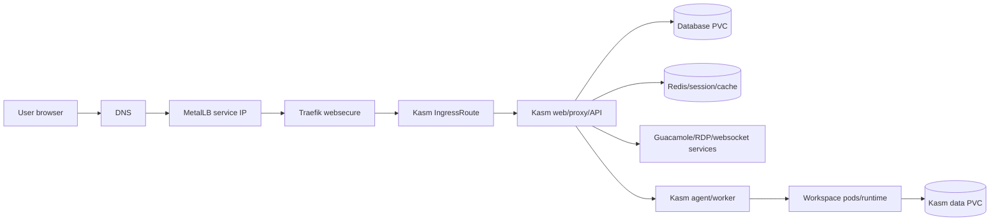

# Kasm Target Architecture

This scaffold targets a Kubernetes-native Kasm Workspaces deployment managed through GitOps. It currently defines the application boundary and infrastructure placeholders only; the official Kasm Kubernetes manifests or Helm chart must be validated before adding workloads.

## Flow

## Components

The web, proxy, and API layer will terminate application traffic behind Traefik. The concrete Kubernetes services, deployments, and image references are intentionally not defined until the official upstream Kasm deployment method is selected.

The database layer should use persistent storage and an explicit backup plan. Redis may need persistence depending on the selected Kasm architecture and should be sized after upstream validation.

Guacamole, RDP, and websocket-related services must be tested through Traefik because browser-based desktop sessions are sensitive to proxy headers, timeouts, TLS behavior, and websocket upgrade handling.

Workspace runtime components should be isolated from the control plane where possible. Future work should separate service accounts, permissions, node scheduling, resource limits, and network policies between Kasm control services and launched workspaces.

## Storage

The scaffold uses `local-path` PVCs by default for lab compatibility. Longhorn can be used later by changing `storageClassName` values after backup, restore, and performance expectations are confirmed.

## Ingress

Traefik `IngressRoute` is used on the `websecure` entry point. Hostnames are placeholders and must be replaced before enabling Flux. TLS is intentionally left as a placeholder because this repo may use either cert-manager, Traefik certResolver, or manually managed TLS secrets depending on the final domain.

## Secrets

`secrets.example.yaml` documents required secret keys only. Do not apply it as-is. Use SOPS, SealedSecrets, ExternalSecrets, or manual Kubernetes secret creation with strong generated values.

## Observability

Kasm should be added to the existing monitoring approach after official workloads exist. Capture application logs, workspace launch failures, database health, Redis health, ingress errors, and resource saturation.

## Backup

Back up database data, Kasm persistent data, and any generated configuration needed to restore workspace definitions. Keep the old `/opt/kasm` archive until login, workspace launch, and restore procedures are validated on Kubernetes.

