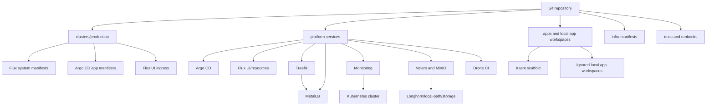
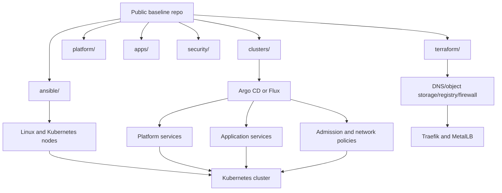
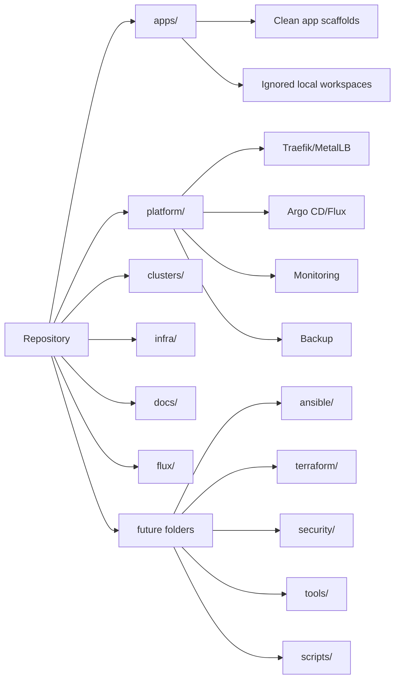
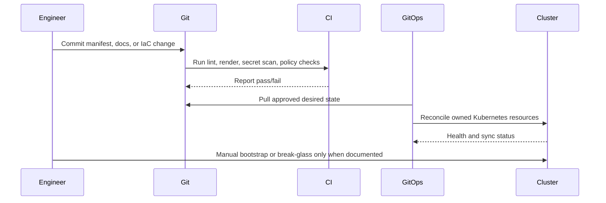

# Architecture

This document describes the inferred current architecture and a proposed target architecture for a reusable DevSecOps platform baseline.

## Current Inferred Architecture

The repository represents a Kubernetes home lab with:

- Kubernetes cluster components such as kube-apiserver, etcd, kubelet, and kube-proxy.
- Networking through MetalLB and Traefik.
- GitOps controllers through Flux and Argo CD.
- Platform services including monitoring, backup, Drone CI, and Kubernetes dashboard variants.
- Storage through local-path and Longhorn-related monitoring/ingress.
- Backup components through Velero and MinIO examples.
- Application workspaces under `apps/`, with Kasm scaffolded for Kubernetes and other apps kept as local nested workspaces.
- Local generated cluster exports present on disk but ignored and untracked.

## Proposed Target Architecture

The target architecture keeps the repository as a clean baseline:

- `clusters/` defines cluster entry points and controller bootstrap.
- `platform/` contains curated platform services with clear GitOps ownership.
- `apps/` contains clean app deployment interfaces and documentation.
- `infra/` contains cluster-adjacent manifests.
- `terraform/` manages external/provider infrastructure later.
- `ansible/` manages Linux and Kubernetes node configuration later.
- `security/` contains policy, detection, and scanning baselines later.
- `tools/` and `scripts/` provide wrappers and validation helpers only.

## Current Architecture Diagram

## Proposed GitOps And IaC Architecture

## Repository Organization Diagram

## Deployment Flow Diagram

## Target Principles

- Git is the desired-state source for Kubernetes resources.
- Terraform owns external infrastructure resources.
- Ansible owns OS and node configuration.
- Helm packages reusable deployments.
- Scripts are wrappers and validation helpers.
- Manual actions are reduced, documented, and reviewed.
- Secrets are never committed as real values.
