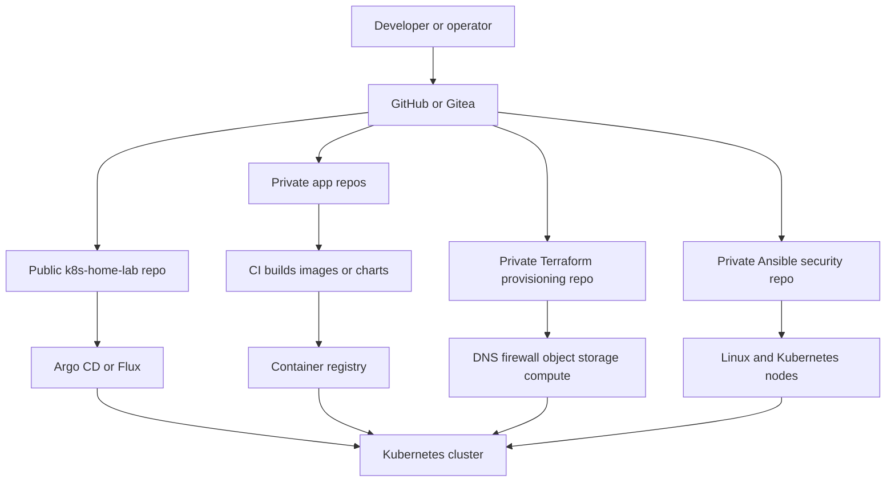
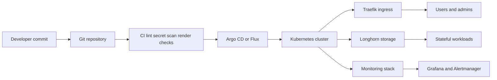
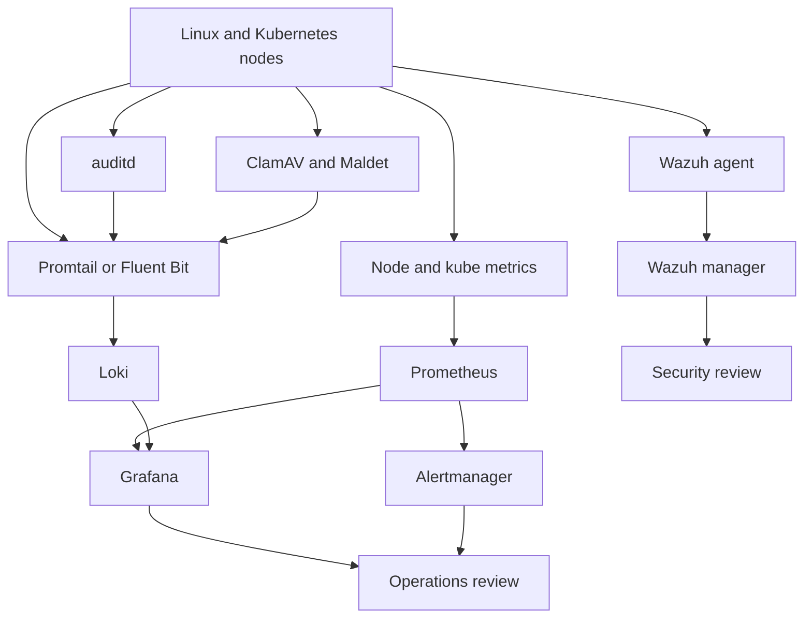
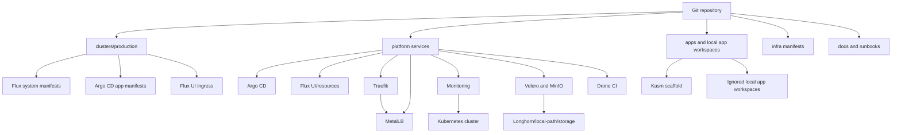
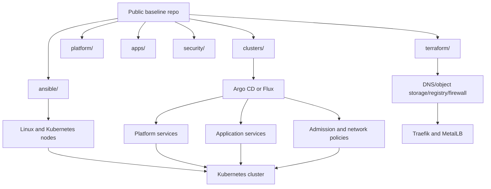
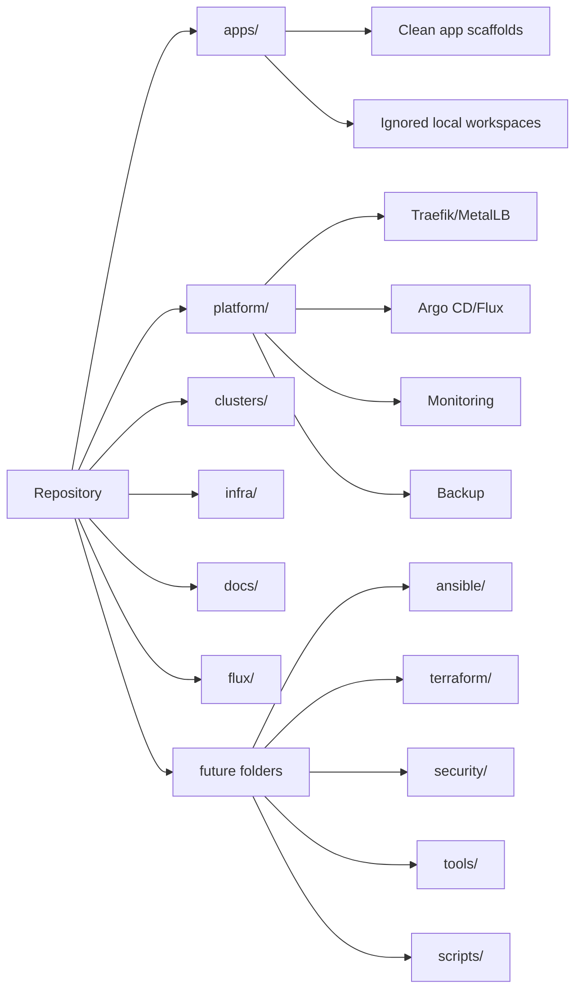
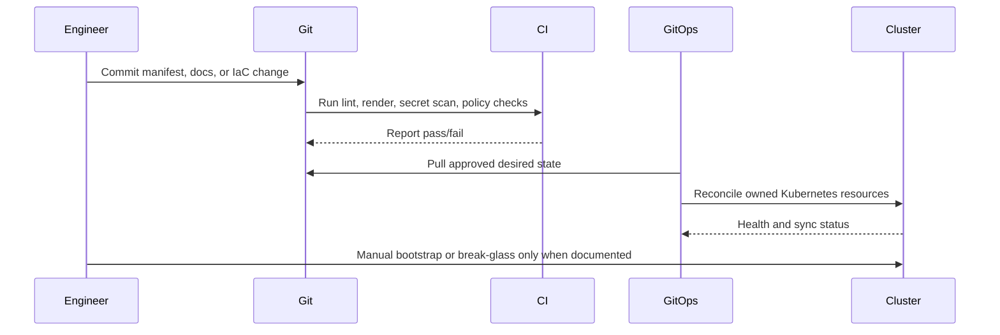
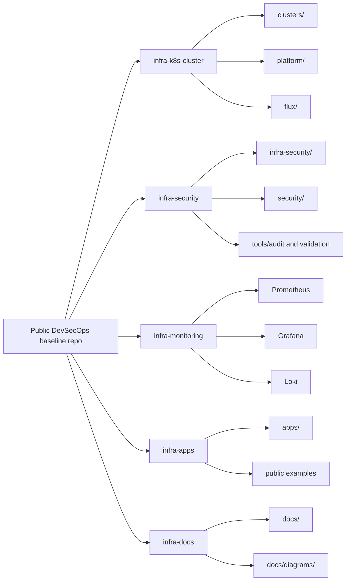
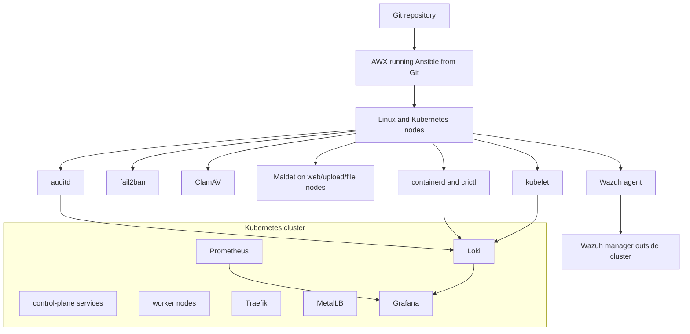
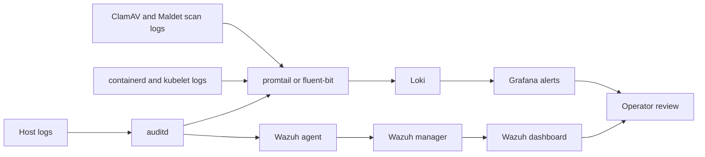

# Architecture

This document describes the inferred current architecture and a proposed target architecture for a reusable DevSecOps platform baseline.

## Intended Portfolio Architecture

This repository is the public portfolio/reference layer. It shows how the Kubernetes platform is organized, how GitOps ownership should work, and how security and operating standards are documented without publishing private environment data.

The intended split is:

- Public `k8s-home-lab` repo: sanitized GitOps examples, platform manifests, docs, runbooks, and public-safe scaffolds.
- Private Terraform repo: real infrastructure provisioning, provider configuration, DNS, firewall, object storage, and state.
- Private Ansible/security repo: real inventories, host hardening, Wazuh enrollment, SSH hardening, firewall automation, and node validation.
- Private app repos: application source code, CI pipelines, and release workflows.
- Kubernetes cluster: reconciles approved platform and app desired state through Argo CD or Flux.

## Workload Direction

Kasm is being treated as the example application migration path: the previous host-managed Docker Compose model should be replaced by a Kubernetes-native, GitOps-friendly deployment after upstream chart or manifest details are validated. The public repo keeps only scaffolded namespace, storage, ingress, documentation, and placeholder secrets.

Drone CI is positioned as a CI system for builds and automation, with real OAuth, RPC, and database secrets managed outside public Git. AWX is positioned as an optional Ansible execution layer for node and host automation, but real inventories and credentials belong in the private Ansible/security repo.

Terraform owns infrastructure provisioning in a private repo. Ansible owns node configuration in a private repo. Argo CD or Flux owns Kubernetes desired state from this public-safe GitOps surface.

## Repository Separation Diagram

## GitOps Flow Diagram

## Node Security And Monitoring Diagram

## Current Inferred Architecture

The repository represents a Kubernetes home lab with:

- Kubernetes cluster components such as kube-apiserver, etcd, kubelet, and kube-proxy.
- Networking through MetalLB and Traefik.
- GitOps controllers through Flux and Argo CD.
- Platform services including monitoring, backup, Drone CI, and Kubernetes dashboard variants.
- Storage through local-path and Longhorn-related monitoring/ingress.
- Backup components through Velero and MinIO examples.
- Application workspaces under `apps/`, with Kasm scaffolded for Kubernetes and other apps kept as local nested workspaces.
- Local generated cluster exports present on disk but ignored and untracked.

## Proposed Target Architecture

The target architecture keeps the repository as a clean baseline:

- `clusters/` defines cluster entry points and controller bootstrap.
- `platform/` contains curated platform services with clear GitOps ownership.
- `apps/` contains clean app deployment interfaces and documentation.
- `infra/` contains cluster-adjacent manifests.
- `terraform/` manages external/provider infrastructure later.
- `ansible/` manages Linux and Kubernetes node configuration later.
- `security/` contains policy, detection, and scanning baselines later.
- `tools/` and `scripts/` provide wrappers and validation helpers only.

## Current Architecture Diagram

## Proposed GitOps And IaC Architecture

## Repository Organization Diagram

## Deployment Flow Diagram

## Target Principles

- Git is the desired-state source for Kubernetes resources.
- Terraform owns external infrastructure resources in a private repo.
- Ansible owns OS and node configuration in a private repo.
- Helm packages reusable deployments.
- Scripts are wrappers and validation helpers.
- Manual actions are reduced, documented, and reviewed.
- Secrets are never committed as real values.

## Repository Responsibility Split

## Runtime Security Architecture

## Security Event Flow

