# Add A New Application With Argo CD

This is the production GitOps workflow for adding an application without
cloning or pulling its repository on the Kubernetes server.

## Result

After this workflow:

1. Application source code stays in its application repository.
2. CI builds and publishes an immutable container image.
3. Kubernetes manifests stay in the app repo or this platform repo.
4. One registry file tells Argo CD where those manifests are.
5. Argo CD pulls Git itself and continuously reconciles the application.
6. ExternalDNS creates the approved Cloudflare record.
7. Traefik routes traffic to the Service.
8. Secrets come from an approved secret workflow, never plaintext Git.

The server does not run `git clone`, `git pull`, `helm install`, or
`kubectl apply` for normal application delivery.

## Architecture

```mermaid
flowchart LR
    developer[Developer] --> apprepo[Application Git repository]
    apprepo --> ci[CI build and test]
    ci --> registry[Container registry]

    operator[Platform reviewer] --> platformrepo[k8s-platform app registry]
    platformrepo --> applicationset[Argo CD ApplicationSet]
    applicationset --> application[Generated Argo Application]
    application --> apprepo
    application --> cluster[Kubernetes namespace]
    registry --> cluster

    cluster --> externaldns[ExternalDNS]
    externaldns --> cloudflare[Cloudflare]
    cloudflare --> traefik[Traefik]
    traefik --> service[Application Service]
```



## Ownership

Flux owns:

- `clusters/production`
- the Argo `AppProject`
- the Argo `ApplicationSet`
- cert-manager and ExternalDNS

Argo CD owns:

- each application generated from
  `clusters/production/app-registry/*.app.yaml`
- the Kubernetes resources rendered from that application's Git path

CI owns:

- tests
- image build
- image scanning
- image publication
- optionally creating a pull request that updates an image tag

CI must not need a cluster-admin kubeconfig.

## Step 1: Prepare The Application Repository

Recommended structure:

```text
example-api/
├── src/
├── Dockerfile
├── .github/workflows/
│   └── image.yaml
└── deploy/
    ├── base/
    │   ├── deployment.yaml
    │   ├── service.yaml
    │   └── kustomization.yaml
    └── overlays/
        └── production/
            ├── ingressroute.yaml
            └── kustomization.yaml
```

The production path must render without local files:

```bash
kubectl kustomize deploy/overlays/production
```

For Helm, the registry path can point to a chart directory instead. Keep the
chart version and image tag explicit.

## Step 2: Use An Immutable Image

Do not deploy `latest`.

Good:

```yaml
image: ghcr.io/thedivine/example-api:sha-7c91e2a
```

Better, when supported:

```yaml
image: ghcr.io/thedivine/example-api@sha256:<digest>
```

The application CI pipeline should:

1. Run tests and security checks.
2. Build for every required CPU architecture.
3. Push the image.
4. Update the production image reference through a reviewed Git commit or pull
   request.

## Step 3: Define The Namespace, Deployment, And Service

Example base Kustomize package:

```yaml
# deploy/base/kustomization.yaml
apiVersion: kustomize.config.k8s.io/v1beta1
kind: Kustomization
resources:
  - deployment.yaml
  - service.yaml
```

The Deployment should include:

- immutable image
- readiness and liveness probes
- CPU and memory requests/limits
- non-root security context
- rolling update strategy
- Secret or ConfigMap references

The Service should normally be `ClusterIP`. Traefik is the public entry point.

Argo CD creates the destination namespace through
`CreateNamespace=true`, so a Namespace manifest is optional unless labels,
quotas, or policies must be applied.

## Step 4: Handle Secrets

Never put a real Kubernetes `Secret` value in the application repository.

Current acceptable bootstrap:

- create the Secret manually from an authorized terminal

Target workflow:

- store the value in the selected external secret platform
- commit an `ExternalSecret` reference
- let External Secrets Operator create the Kubernetes Secret

The application Deployment references only the Kubernetes Secret name:

```yaml
envFrom:
  - secretRef:
      name: example-api-env
```

See `docs/external-secrets-migration.md`.

## Step 5: Add The Public Route

For a standard Kubernetes Ingress:

```yaml
apiVersion: networking.k8s.io/v1
kind: Ingress
metadata:
  name: example-api
  annotations:
    external-dns.alpha.kubernetes.io/cloudflare-proxied: "true"
    external-dns.alpha.kubernetes.io/target: "69.30.233.178"
spec:
  ingressClassName: traefik
  rules:
    - host: api.getuntoldstory.com
      http:
        paths:
          - path: /
            pathType: Prefix
            backend:
              service:
                name: example-api
                port:
                  number: 80
```

For a Traefik `IngressRoute`:

```yaml
apiVersion: traefik.io/v1alpha1
kind: IngressRoute
metadata:
  name: example-api
  annotations:
    external-dns.alpha.kubernetes.io/cloudflare-proxied: "true"
    external-dns.alpha.kubernetes.io/target: "69.30.233.178"
spec:
  entryPoints:
    - websecure
  routes:
    - kind: Rule
      match: Host(`api.getuntoldstory.com`)
      services:
        - name: example-api
          port: 80
  tls:
    certResolver: le
```

Current routes use Traefik ACME. New applications may instead use a
cert-manager `Certificate` and `tls.secretName`; follow
`docs/cloudflare-dns-and-certificates.md` and test staging first.

The hostname must be inside an ExternalDNS domain filter. Current filters are:

- `xn--cyberlnx-ykb.com`
- `getuntoldstory.com`

Adding another domain requires updating the Cloudflare token scope,
ExternalDNS filters, and cert-manager issuer zones.

## Step 6: Give Argo CD Repository Access

### Public Repository

No repository credential is normally required. The registry entry can use:

```yaml
repoURL: https://github.com/TheDivine/example-api.git
```

### Private Repository

Argo CD currently has no configured repository credential Secret.

Recommended approach:

1. Create a GitHub App with read-only `Contents` permission.
2. Install it only on repositories Argo CD should read.
3. Add it under Argo CD **Settings -> Repositories**, or manage the repository
   credential through the approved external secret workflow.
4. Test the connection before adding the application registry file.

Do not copy your personal SSH private key into the Argo CD namespace. Do not
commit a GitHub token or GitHub App private key.

## Step 7: Add The Registry File

Create:

```text
clusters/production/app-registry/example-api.app.yaml
```

Contents:

```yaml
app:
  name: example-api
  repoURL: https://github.com/TheDivine/example-api.git
  revision: main
  path: deploy/overlays/production
  namespace: example-api
```

You can create this file directly in the GitHub web interface:

1. Open `TheDivine/k8s-platform`.
2. Browse to `clusters/production/app-registry`.
3. Choose **Add file -> Create new file**.
4. Name it `example-api.app.yaml`.
5. Add the YAML above.
6. Choose **Create a new branch and start a pull request**.
7. Review the rendered path, namespace, repository, secrets, route, and
   rollback plan.
8. Merge the pull request.

No server checkout is involved.

## Step 8: What Happens After Merge

1. Flux reads `main` and keeps the ApplicationSet definition installed.
2. The ApplicationSet Git generator reads the new registry file.
3. It creates an Argo CD Application named `example-api`.
4. Argo CD pulls the application repository.
5. Argo renders the configured path.
6. Argo creates the namespace and resources.
7. ExternalDNS creates the Cloudflare A/TXT records.
8. Traefik starts routing when the Service endpoints are Ready.

The ApplicationSet polls Git periodically. A webhook can be added later to
reduce the polling delay.

## Step 9: Verify The Deployment

Argo CD:

```bash
kubectl -n argocd get applications
kubectl -n argocd describe application example-api
```

Application:

```bash
kubectl -n example-api get deploy,pods,svc
kubectl -n example-api rollout status deployment/example-api
kubectl -n example-api get events --sort-by=.lastTimestamp
```

Route and DNS:

```bash
kubectl -n example-api get ingress,ingressroute.traefik.io
kubectl -n external-dns logs deploy/external-dns --tail=100
```

Certificate:

```bash
kubectl get certificate,certificaterequest,order,challenge -A
```

Do not call an application production-ready until:

- Argo reports `Synced` and `Healthy`
- pods are Ready
- the Service has endpoints
- HTTPS works through Cloudflare
- authentication works
- logs and metrics are visible
- rollback has been tested

## Updating The Application

Normal application update:

1. Commit source code.
2. CI builds a new immutable image.
3. Update the image tag or digest in Git.
4. Merge the pull request.
5. Argo CD detects the Git change and performs the rollout.

Do not SSH into a node to edit a Deployment. Do not use `kubectl set image` as
the normal release method because Argo will restore the Git value.

## Rollback

Preferred rollback:

1. Revert the manifest or image-tag commit.
2. Merge the revert.
3. Argo CD reconciles the previous desired state.

Emergency rollback may use Argo history, but the final state must still be
recorded in Git.

## Decommissioning

The production ApplicationSet uses `applicationsSync: create-update` and
preserves resources when a registry entry is removed. This prevents an
accidental file deletion from immediately deleting a production application.

Deliberate removal:

1. Back up application data.
2. Disable public traffic or show a maintenance page.
3. Remove the registry file through a reviewed pull request.
4. Manually delete the Argo Application with the approved prune decision.
5. Confirm PVC, DNS, TLS, and external secrets retention requirements.
6. Remove retained resources only after the recovery window.

## Existing Apps To Onboard

Recommended first candidate:

- CyberLynx Blog: repository `TheDivine/CyberLynxBlog`, path `k8s`,
  namespace `websites`

Before adding it, compare the image in Git with the live image. On
2026-06-07, they differed, so onboarding would also perform an application
release.

Do not onboard yet:

- Kasm: scaffold only
- Kwiki/Qwiki: repository name and deployment path are unresolved
- Law firm: production overlay and secret ownership need review
- Hello/Whoami: diagnostic workloads need a canonical package or removal

## Official References

- Argo CD Git generator:
  https://argo-cd.readthedocs.io/en/latest/operator-manual/applicationset/Generators-Git/
- Argo CD private repositories:
  https://argo-cd.readthedocs.io/en/latest/user-guide/private-repositories/
- Argo CD automated sync:
  https://argo-cd.readthedocs.io/en/stable/user-guide/auto_sync/
