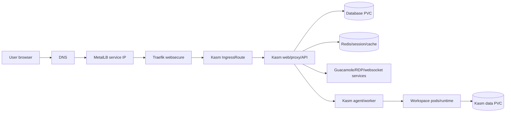
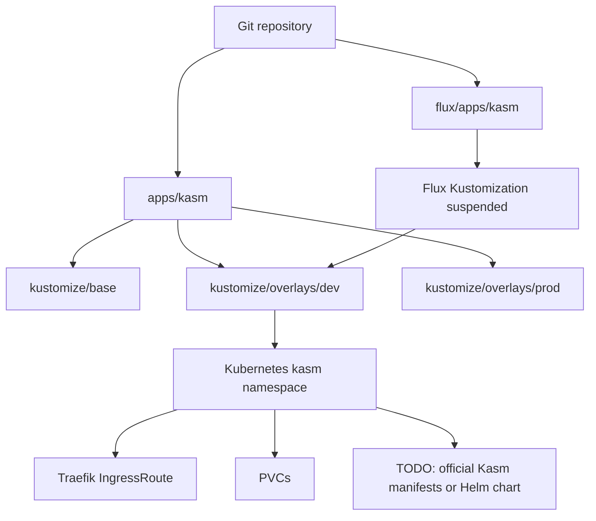

# Kasm Architecture Diagrams

## Runtime Architecture

```mermaid
flowchart LR
    user[User browser] --> dns[DNS]
    dns --> metallb[MetalLB service IP]
    metallb --> traefik[Traefik websecure]
    traefik --> ingress[Kasm IngressRoute]
    ingress --> web[Kasm web/proxy/API]
    web --> db[(Database PVC)]
    web --> redis[(Redis/session/cache)]
    web --> guac[Guacamole/RDP/websocket services]
    web --> agent[Kasm agent/worker]
    agent --> workspace[Workspace pods/runtime]
    workspace --> data[(Kasm data PVC)]
```

## GitOps Organization

```mermaid
flowchart TB
    repo[Git repository] --> app[apps/kasm]
    app --> base[kustomize/base]
    app --> dev[kustomize/overlays/dev]
    app --> prod[kustomize/overlays/prod]
    repo --> flux[flux/apps/kasm]
    flux --> suspended[Flux Kustomization suspended]
    suspended --> dev
    dev --> cluster[Kubernetes kasm namespace]
    cluster --> traefik[Traefik IngressRoute]
    cluster --> storage[PVCs]
    cluster --> official[TODO: official Kasm manifests or Helm chart]
```

