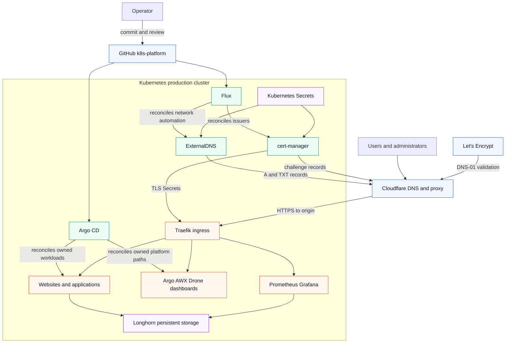
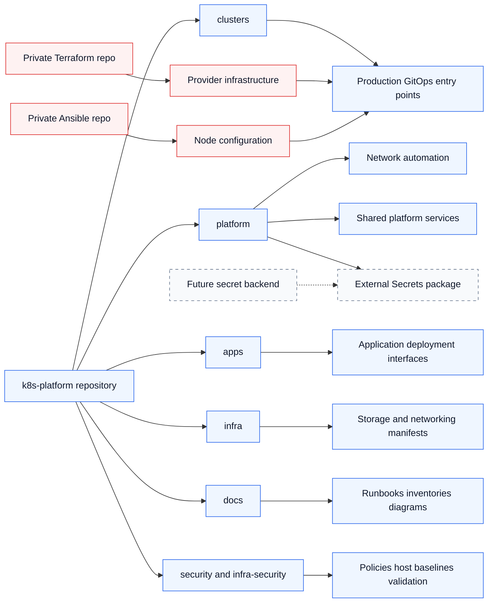
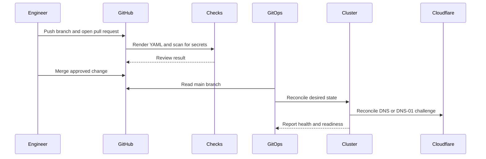

# Platform Architecture Diagrams

These Mermaid diagrams render as visual architecture images in GitHub while
remaining reviewable text in Git.

## Production Request And Automation Flow

Current boundaries:

- ExternalDNS manages only `xn--cyberlnx-ykb.com` and
  `getuntoldstory.com`, with TXT ownership and `upsert-only` policy.
- cert-manager uses Cloudflare DNS-01 with separate staging and production
  ClusterIssuers.
- Existing routes continue using Traefik ACME until each certificate is
  migrated deliberately.
- Cloudflare tokens currently live in Kubernetes Secrets. External Secrets is
  staged but not enabled until a backend is selected.
- Flux and Argo CD must not own the same Kubernetes resource.

## Repository And Ownership Structure

## Change Promotion Flow

