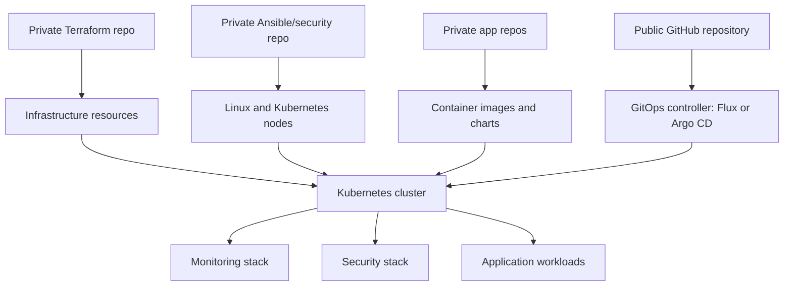
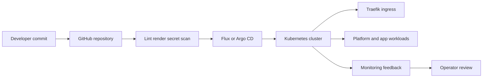
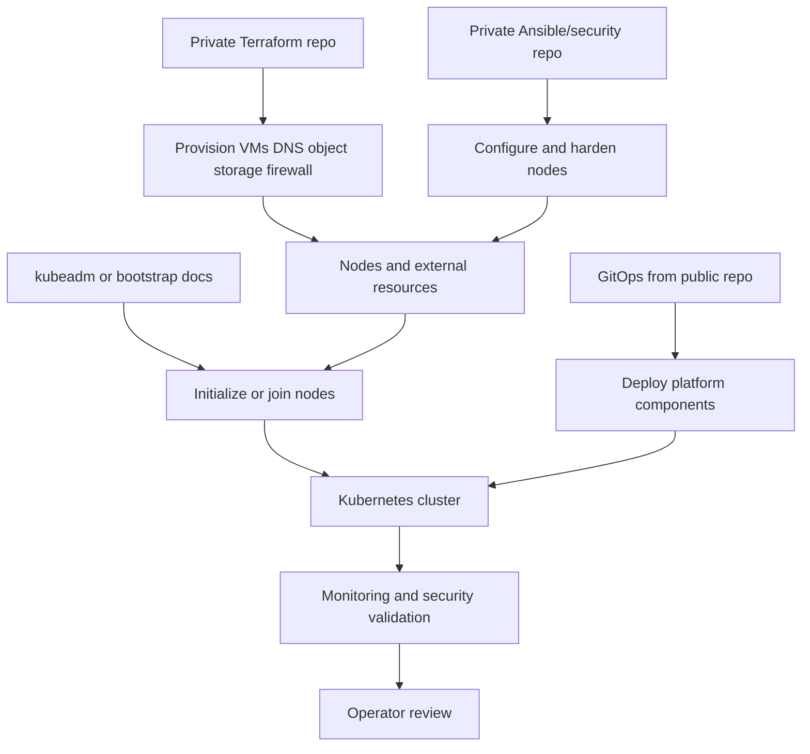
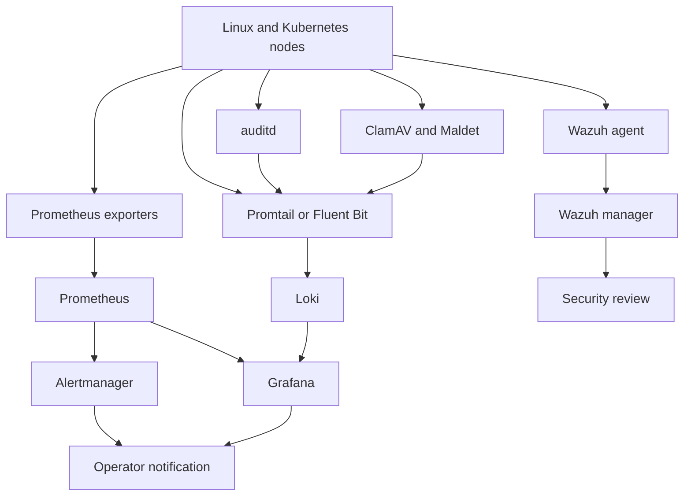
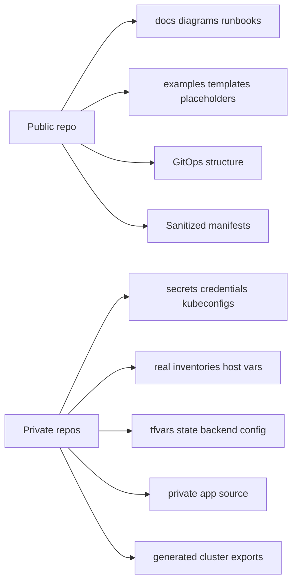

# Platform Architecture Diagrams

## 1. High-Level Repository Architecture

## 2. GitOps Deployment Flow

## 3. Infrastructure Provisioning And Configuration Flow

## 4. Security And Observability Architecture

## 5. Public And Private Repo Boundary

