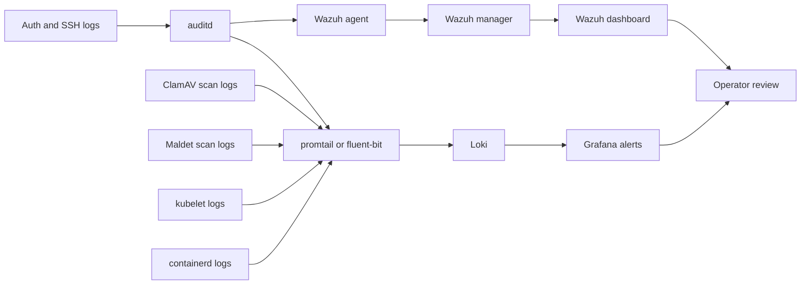
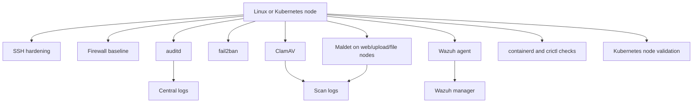

# Security Observability Diagrams

## Security Event Flow

```mermaid
flowchart LR
    auth[Auth and SSH logs] --> auditd[auditd]
    auditd --> wazuhAgent[Wazuh agent]
    auditd --> logShipper[promtail or fluent-bit]

    clamav[ClamAV scan logs] --> logShipper
    maldet[Maldet scan logs] --> logShipper
    kubelet[kubelet logs] --> logShipper
    containerd[containerd logs] --> logShipper

    logShipper --> loki[Loki]
    loki --> grafana[Grafana alerts]
    wazuhAgent --> wazuhManager[Wazuh manager]
    wazuhManager --> wazuhDashboard[Wazuh dashboard]

    grafana --> review[Operator review]
    wazuhDashboard --> review
```

## Host Security Layers

```mermaid
flowchart TB
    host[Linux or Kubernetes node]
    host --> ssh[SSH hardening]
    host --> firewall[Firewall baseline]
    host --> audit[auditd]
    host --> bans[fail2ban]
    host --> av[ClamAV]
    host --> webscan[Maldet on web/upload/file nodes]
    host --> wazuh[Wazuh agent]
    host --> runtime[containerd and crictl checks]
    host --> k8s[Kubernetes node validation]

    audit --> logs[Central logs]
    av --> scanLogs[Scan logs]
    webscan --> scanLogs
    wazuh --> siem[Wazuh manager]
```
